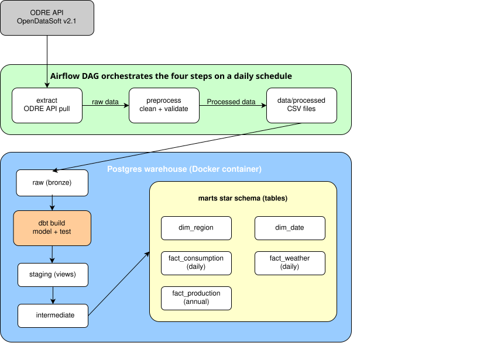
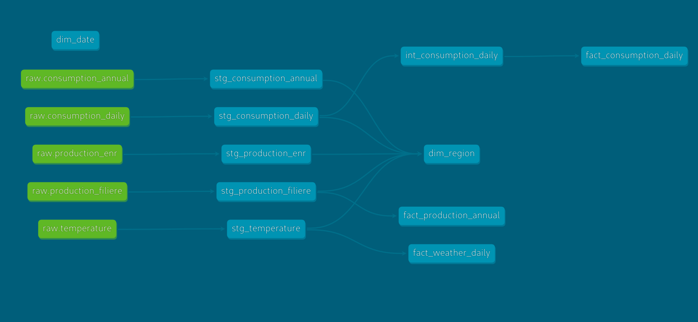
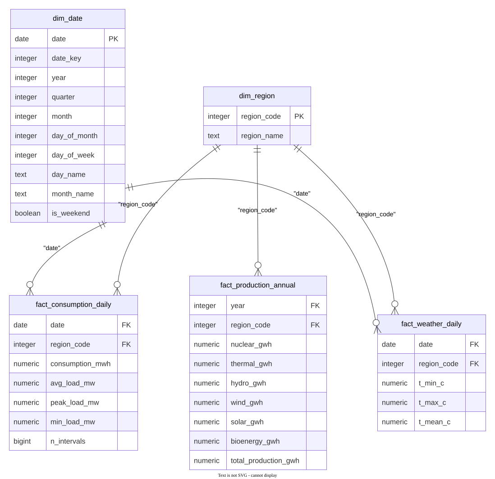
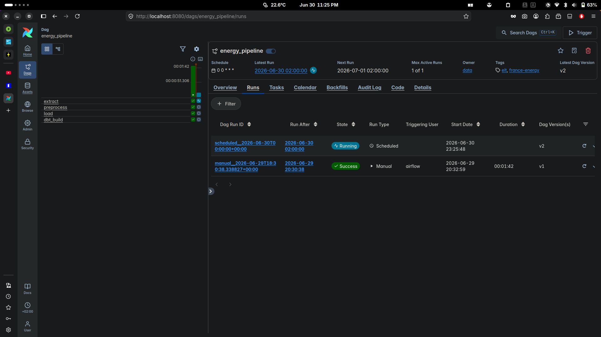

# France Energy ELT

A data pipeline that pulls French regional energy data, cleans it, loads it into
Postgres, and models it with dbt into tables that are easy to query and analyze.
The whole pipeline runs on a schedule through Airflow, all in Docker.

The data comes from ODRE (Open Data Réseaux Énergies), France's open energy data
portal. It covers electricity consumption (half-hourly and annual, by region),
daily temperature by region, and yearly electricity production broken down by
source (nuclear, wind, solar, and so on). The earliest data goes back to 2013.

## Architecture

Data moves left to right and gets cleaner at each stage. The Python scripts pull,
clean, and land the data in Postgres; dbt models it into the final tables.



## How it works

The pipeline runs in four steps.

**1. Extract** `scripts/extract.py`
Pulls the data from the ODRE API and saves raw CSVs into `data/raw/`. The big
daily consumption dataset (around 2.8 million rows) is fetched incrementally,
only the days you don't already have, while the smaller yearly datasets are
re-downloaded each time. On a first run with no existing file, the daily backfill
is fetched in yearly slices so no single request is too large to complete.

**2. Preprocess** `scripts/preprocess.py`
Reads the raw CSVs, renames the columns to plain English, fixes the types,
filters out unvalidated and bad rows, and writes clean CSVs to `data/processed/`.
Before saving, it runs checks (row counts, value ranges, region codes, missing
values). If something looks wrong, it stops with an error instead of passing bad
data along.

**3. Load** `scripts/load.py`
Loads the clean CSVs into Postgres, into a schema called `raw`, with every column
stored as text. This is the landing zone: data goes in exactly as it came out of
preprocessing, no logic applied. It uses Postgres COPY so even the big table loads
in a few seconds. On each run it truncates and reloads, so the tables stay in
place and dbt's dependent views remain valid across runs.

**4. Transform** dbt, in `energy_analytics/`
This is where the raw tables become useful. The models are organized in three
layers, each its own schema in Postgres:

- `staging` reads from the `raw` tables, one model per source, casting the text
  columns to real types (dates, numbers). One-to-one with the raw tables.
- `intermediate` rolls the half-hourly consumption up into daily totals (energy
  in MWh, plus peak and average load). Only the consumption data passes through
  this layer, because it's the only source whose grain has to change. The
  already-daily and already-annual sources go straight from staging to marts.
- `marts` are the final tables, shaped as a star schema: two shared dimensions
  (`dim_region`, `dim_date`) and three fact tables for consumption, weather, and
  production.

Note that the `raw` schema is created and loaded by `load.py`, not by dbt. dbt
reads from `raw` as a source and owns everything above it.

### dbt lineage

How the models flow from the raw sources through staging, intermediate, and into
the marts:



### Star schema

The final marts, with the fact tables joined to the shared dimensions on
`region_code` and `date`. Referential integrity is enforced through dbt tests, not
database foreign-key constraints.



`fact_production_annual` joins `dim_region` but not `dim_date`, because it's annual
data keyed by year rather than by day.

## Orchestration with Airflow

The four steps are wired together as an Airflow DAG (`dags/energy_pipeline.py`) so
the whole pipeline runs as one scheduled job instead of four manual commands:

```
extract -> preprocess -> load -> dbt_build
```



It runs on a daily schedule, with retries on the API and IO steps. The whole stack
runs locally in Docker, so there is no setup beyond `docker compose up`.

**Design:**

- **LocalExecutor**, so no Celery, Redis, or separate worker to run.
- **Two separate Postgres containers.** One is Airflow's internal metadata
  database, the other is the `warehouse` holding the actual data (the `raw` schema
  plus the dbt schemas). They are isolated so the pipeline never touches Airflow's
  bookkeeping.
- **Bind-mounted code.** `scripts/`, `energy_analytics/`, `dags/`, and `data/` are
  mounted into the containers, so editing a script or the DAG takes effect without
  rebuilding the image.

## Testing

Checks happen at every step, so problems get caught early instead of showing up as
wrong numbers later:

- The preprocess checks stop bad data before it reaches the database.
- `pytest` (in `tests/`) tests the cleaning logic and the extract backfill logic on
  small sample data.
- dbt tests run after the models build, checking for missing values, valid region
  codes, that every fact row links to a real region and date, and that there's
  exactly one row per region per day (or per year).

## Running it

You'll need Postgres running and a few environment variables set. Put them in a
`.env` file (copy `.env.example` to start):

```
PGHOST=localhost
PGPORT=5433        # the warehouse container maps to host port 5433
PGUSER=energy_user
PGPASSWORD=yourpassword
PGDATABASE=energy
AIRFLOW_SECRET_KEY=changeme   # shared by Airflow's API secret and JWT secret
```

### With Airflow (the normal way)

```bash
cp .env.example .env                    # set warehouse creds + the Airflow secret
echo "AIRFLOW_UID=$(id -u)" >> .env     # Linux only

docker compose build
docker compose up -d
```

Open the Airflow UI at `localhost:8080` (login `airflow` / `airflow`), unpause
`energy_pipeline`, and trigger a run. Stop the stack with `docker compose stop` and
resume it with `docker compose start`.

### Running a single step by hand

The individual scripts still work directly, which is handy during development:

```bash
pip install -r requirements.txt

python scripts/extract.py        # pull from the API
python scripts/preprocess.py     # clean + validate
python scripts/load.py           # load into Postgres raw schema

cd energy_analytics
export DBT_PROFILES_DIR=.
dbt deps                         # install dbt packages
dbt build                        # build all models + run tests
```

After that, the modeled tables live in the `marts` schema, ready to query.

## Continuous integration

There's a GitHub Actions workflow in `.github/` that runs on every pull request.
It runs the Python tests, then spins up a throwaway Postgres, loads small sample
files from `ci/seeds/`, and runs the full dbt build. It uses the sample data
instead of the real millions of rows, so it's fast and doesn't depend on the API
being up. If a change breaks something, the PR shows a red check.

## Project layout

```
dags/             the Airflow DAG
scripts/          extract, preprocess, load
tests/            python tests for the cleaning + backfill logic
energy_analytics/ the dbt project (staging, intermediate, marts)
ci/seeds/         small sample files used by CI
data/raw/         raw downloads (not committed)
data/processed/   cleaned files (not committed)
docs/             notes, design docs, and diagrams
docker-compose.yaml, Dockerfile   the local Airflow + warehouse stack
.github/          CI workflow
```

## Roadmap

The pipeline runs locally end to end, orchestrated by Airflow. The next phase is a
cloud rebuild: the same DAG pointed at GCS (for raw and processed storage) and
BigQuery (as the warehouse, with a dbt BigQuery target) instead of local files and
Postgres, keeping the orchestration layer the same while swapping the storage and
compute underneath.